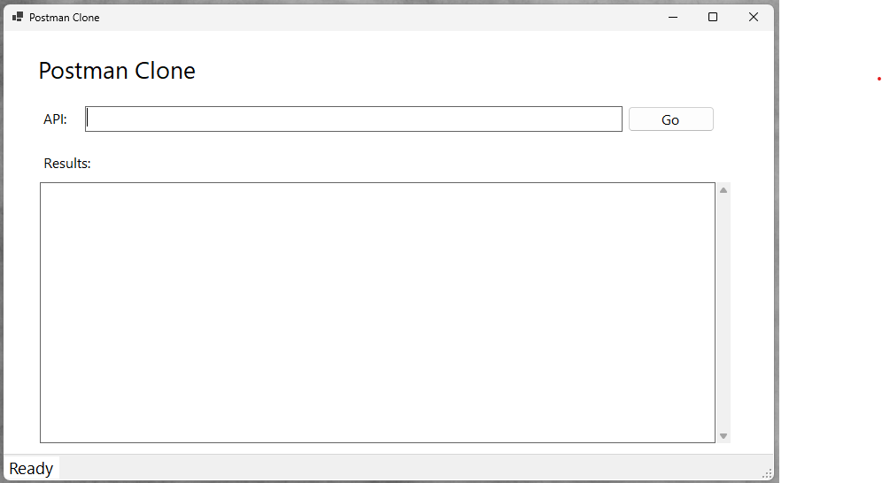

# Postman Clone
Postman Clone provides a user-friendly interface for making GET requests to APIs and viewing the responses in formatted JSON. Ideal for developers and testers, this tool simmplifies API interaction and debugging, helping you efficiently validate your API calls. 

## Technologies Used
* C#
* .Net 8
* Winforms
* HTTPClient

## Using The App

